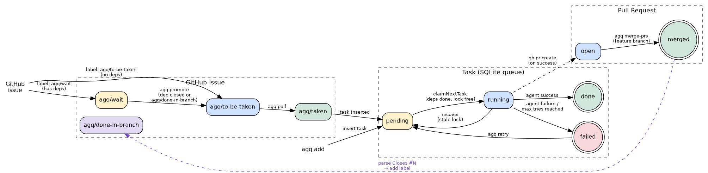

# agq — Agent Queue

A standalone Haskell binary that schedules and runs agentic tasks with DAG dependency enforcement, tag-based locking, and GitHub issue integration.

- Tasks declare dependencies by **name**; `agq` only schedules a task once all its deps are `done`.
- Tasks carry **tags**; `agq` holds an exclusive lock on each tag while a task runs — other tasks sharing any tag are held back.
- Both local and GitHub-sourced tasks live in the same SQLite database with the same lifecycle.



---

## Installation

```bash
# from the agents-exe repo root
cabal build agq
cabal install agq   # puts agq on PATH via ~/.cabal/bin
```

---

## Configuration — `agq.json`

`agq` looks for `./agq.json` by default (override with `-c path/to/agq.json`).

```json
{
  "queueDb":          "tasks/agq.db",
  "taskDir":          "tasks",
  "sessionsDir":      "tasks-sessions",
  "baseBranch":       "main",
  "githubUsername":   "lucasdicioccio",
  "pollSeconds":      30,
  "lockStaleSeconds": 7200,
  "defaultTries":     3,
  "projects": {
    "root":      ".",
    "architect": "."
  },
  "agents": {
    "default":   "tasks-agents/kimi-agent-oneshot.json",
    "architect": "tasks-agents/kimi-architect.json"
  },
  "hooks": {
    "default": "git-agent-task.sh"
  },
  "labels": {
    "labelToBeTaken":    "agq/to-be-taken",
    "labelTaken":        "agq/taken",
    "labelWait":         "agq/wait",
    "labelAgentPr":      "agq/agent-pr",
    "labelDoneInBranch": "agq/done-in-branch"
  }
}
```

| Field | Meaning |
|-------|---------|
| `queueDb` | Path to the SQLite database file |
| `taskDir` | Directory where instruction `.md` files live |
| `sessionsDir` | Directory where session and error files are written (inside the worktree) |
| `baseBranch` | Fallback git branch when `git symbolic-ref` cannot detect the remote default |
| `githubUsername` | Only issues from this author are imported by `pull` |
| `pollSeconds` | How long `process --loop` sleeps between polls when the queue is empty |
| `lockStaleSeconds` | Locks older than this (seconds) are released by `recover` |
| `defaultTries` | Default `tries_remaining` for tasks imported via `pull` |
| `projects` | Maps a label → relative path inside the worktree |
| `agents` | Maps a label → agent config file path |
| `hooks` | Maps a label → hook script path (relative to the project dir inside the worktree); falls back to `"default"`; omit to run no hook |
| `labels.labelToBeTaken` | GitHub label meaning "ready to pick up" |
| `labels.labelTaken` | GitHub label applied after an issue is imported |
| `labels.labelWait` | GitHub label meaning "blocked on dependencies" |
| `labels.labelAgentPr` | GitHub label applied to PRs created by the agent |
| `labels.labelDoneInBranch` | GitHub label added to issues closed by a PR merged into a feature branch (see [Feature-branch DAG](#feature-branch-dag)) |

---

## Commands

### `agq init`

Creates `taskDir`, `sessionsDir`, and the SQLite database with its full schema.
Also verifies that `.gitignore` contains entries for the verbose agent log files
(`agents-logfile`, `logs.json`, `conv.*.json`), adding any that are missing so
that `git add -A` inside a worktree never accidentally commits them.

Safe to run multiple times (all DDL uses `CREATE … IF NOT EXISTS`).

```bash
agq init
```

---

### `agq init-labels`

Creates (or updates) all GitHub labels defined in the config: the five workflow
labels (`agq/to-be-taken`, `agq/taken`, `agq/wait`, `agq/agent-pr`,
`agq/done-in-branch`) and one label per project key. Uses
`gh label create --force` so it is idempotent.

```bash
agq init-labels
```

---

### `agq add <LABEL> <NAME> [--dep NAME]… [--tag TAG]… [--tries N]`

Adds a local task to the queue.

- Creates `tasks/<NAME>.md` if it doesn't exist, then opens `$EDITOR` when the file is empty.
- `LABEL` must match a key in the `projects` map (determines which agent config and project directory are used).
- `--dep` may be repeated; each value is the name of another task that must be `done` first.
- `--tag` may be repeated; tasks sharing a tag cannot run concurrently. The label is always added as a tag automatically.
- `--tries N` sets how many execution attempts are allowed (default: `defaultTries` from config).
- The base branch is detected automatically from `git symbolic-ref refs/remotes/origin/HEAD`.

```bash
agq add root feat-auth
agq add root feat-api --dep feat-auth
agq add root feat-tests --dep feat-auth --dep feat-api --tag slow --tries 2
```

---

### `agq pull`

Imports GitHub issues into the queue. Only issues that:
- carry the `agq/to-be-taken` label, **and**
- were authored by `githubUsername`, **and**
- carry at least one label matching a key in `projects`

are imported. Each issue is verified to actually have the `agq/to-be-taken` label
in its own label list (not just matched by the `gh` query), guarding against
edge cases where the `gh` CLI returns unexpected results.

For each qualifying issue:
1. Downloads the title and body into `tasks/gh-<N>.md` (skipped if already populated).
2. Parses `Base-branch:`, `Final:`, and `Tries:` metadata headers from the issue body.
3. Parses `Depends-on: #N, #M` to wire up task dependencies.
4. Inserts the task with `INSERT OR IGNORE` (idempotent — re-running `pull` is safe).
5. Moves the issue label from `agq/to-be-taken` → `agq/taken`.

**Metadata headers** (anywhere in the issue body):

```
Base-branch: feat/my-feature
Final: true
Depends-on: #42, #43
Tries: 2
```

---

### `agq promote`

Checks all issues labelled `agq/wait`. For each one, resolves the `Depends-on:`
refs (via `gh issue view` / `gh pr view`). A dependency is considered satisfied
when it is:
- **closed** on GitHub, or
- **not found** (deleted, transferred) — treated as done, or
- labelled **`agq/done-in-branch`** — closed by a PR merged into a feature branch.

If all deps are satisfied, the issue is promoted to `agq/to-be-taken` so the
next `pull` will import it.

```bash
agq promote
```

---

### `agq status`

Prints a table of all tasks showing ID, name, label, status, tries remaining, dependencies, and tags. Also lists any active locks.

```
ID    NAME                          LABEL       STATUS    TRIES DEPS                TAGS
------------------------------------------------------------------------------------------------
1     feat-auth                     root        done      0                         root
2     feat-api                      root        pending   3     feat-auth           root
3     feat-tests                    root        pending   2     feat-auth,feat-api  root,slow
```

---

### `agq process [--parallel] [--loop]`

The main scheduling loop:

1. Calls `recover` to release any stale locks.
2. Atomically claims the next **ready** task (pending, `tries_remaining > 0`, all deps done, no conflicting lock, exclusive SQLite transaction).
3. Executes it (see `exec` below).
4. Loops. When no task is claimable but some are still pending/running, sleeps `pollSeconds` then retries.
5. Without `--loop`: exits when the queue is fully empty. With `--loop`: keeps polling forever.

`--parallel` forks each task in a new thread instead of running sequentially.

```bash
agq process
agq process --parallel
agq process --loop
agq process --parallel --loop
```

---

### `agq exec <NAME>`

Executes a single named task directly (also used internally by `process`):

1. `git fetch origin <base-branch>`
2. `git worktree add <name> origin/<base-branch>`
3. Runs `<hook> prepare <label> <name> <instruction-file>` if a hook script is configured and exists.
4. Runs `agents-exe --agent-file <config> run --session-file <session.json> -f <instruction>`, capturing stdout as the commit message and stderr for error reporting.
5. **On agent failure**: writes the full stderr to `<sessionsDir>/<name>.err` inside the worktree, posts the last 100 lines as a comment on the originating GitHub issue (for `gh`-sourced tasks), marks the task `failed`, and stops.
6. Runs `agents-exe session-print <session.json>` and writes the output to `<sessionsDir>/<name>.session.md` inside the worktree.
7. `git checkout -b <name> && git add -A && git commit --no-verify -m <commit-msg>`
8. `git push -u origin <name>`
9. `gh pr create --base <target> --head <name> --label agq/agent-pr`
10. Runs `<hook> preview <label> <name> <instruction-file>` if the hook exists.
11. Marks the task `done` and releases locks.

Session and error files live **inside the worktree** so they are committed with the work.

```bash
agq exec gh-42
```

---

### `agq retry <NAME> [--tries N]`

Resets a `failed` (or stuck `running`) task back to `pending` and restores its
`tries_remaining` to `N` (default: `defaultTries` from config). The task will
be picked up by the next `process` cycle.

```bash
agq retry gh-42
agq retry gh-42 --tries 1
```

---

### `agq merge-prs`

Merges all open PRs labelled `agq/agent-pr` whose base branch is **not** the
repo's default branch (i.e. intermediate feature-branch PRs). Uses
`gh pr merge --merge --auto`.

After triggering the merge, `agq` parses `Closes / Fixes / Resolves #N` lines
from the PR body and adds the `agq/done-in-branch` label to every referenced
issue. This signals to `agq promote` that those issues are satisfied even though
GitHub will not auto-close them (the PR targets a feature branch, not `main`).

PRs that already target the default branch are skipped — GitHub handles closure
for those automatically.

```bash
agq merge-prs
```

---

### `agq clean [--do-it] [--force]`

Removes git worktrees for tasks that have a completed session log
(`<sessionsDir>/<name>.session.md`).

Without `--do-it`, prints a preview of what would be removed.
`--force` passes `--force` to `git worktree remove` for worktrees with uncommitted changes.

```bash
agq clean           # preview
agq clean --do-it
agq clean --do-it --force
```

---

### `agq recover`

Finds locks held longer than `lockStaleSeconds` without a running task and
resets those tasks to `pending`. Useful after a crash or `kill`.

```bash
agq recover
```

---

## Feature-branch DAG

When a chain of issues (A → B → C) all target the same feature branch (not
`main`), GitHub will not auto-close issue A when the PR for A merges into that
branch. The standard `agq` loop handles this transparently:

1. `agq merge-prs` auto-merges the PR for A into the feature branch and parses
   its `Closes #A` line → adds `agq/done-in-branch` to issue A.
2. `agq promote` sees issue A is labelled `agq/done-in-branch` → promotes issue
   B from `agq/wait` to `agq/to-be-taken`.
3. `agq pull` imports issue B and the agent works on it.

The label is intentionally left on issue A; it has no effect once B and C have
progressed, and it provides a clear audit trail.

---

## Task Sources

Tasks carry a **source** that records where they originated:

| Source | Stored as | Created by |
|--------|-----------|------------|
| `SourceLocal` | `local` | `agq add` |
| `SourceGithub N` | `github:42` | `agq pull` (carries the issue number) |

The source is used to decide whether to post failure comments back to GitHub.
New trackers (Jira, Linear, …) will add new constructors without changing existing behaviour.

---

## Tries / Retry Logic

Each task has a `tries_remaining` counter:

- Set to `defaultTries` (or `--tries N`) when the task is created or imported.
- Decremented by 1 each time the task is claimed for execution.
- A task with `tries_remaining = 0` is **not** scheduled even if it is `pending`.
- `agq retry` restores `tries_remaining` so the task can run again.

This prevents a permanently broken task from spinning in an infinite retry loop.

---

## Database Schema

```sql
tasks        -- one row per task; status: pending | running | done | failed
task_deps    -- (task_id, dep_name)  — dep resolved by name at claim time
task_tags    -- (task_id, tag)       — lock scope
locks        -- (tag, task_name, acquired_at) — held while a task runs
```

A task is **ready** when:
- `status = 'pending'` and `tries_remaining > 0`
- Every row in `task_deps` has a corresponding `tasks` row with `status = 'done'`
- None of its tags appear in `locks`

The claim query runs inside an SQLite exclusive transaction, making it safe to
run multiple `agq process` instances concurrently.

---

