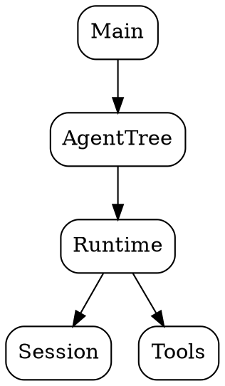

# AI Assistant Guidelines - Agents Framework

This document provides guidance for AI assistants (including future instances of myself) working on the Agents framework codebase.

## Quick Start for AI Assistants

### First Steps

When invoked on this codebase, always:

1. **Check the knowledge base** - Query `sqlite_knowledge_store_query` for existing state
2. **Review recent commits** - Use `bash_get_git_log` to see what's changed
3. **Check existing docs** - Review `docs_index` table for current documentation
4. **Identify the task** - Understand what changes or documentation are needed

### Essential Queries

```sql
-- Get project overview
SELECT * FROM project_overview;

-- List all documented modules
SELECT * FROM code_index WHERE documented_in IS NOT NULL;

-- Find undocumented modules
SELECT filepath, module_name FROM code_index WHERE documented_in IS NULL;

-- Check existing documentation
SELECT * FROM docs_index;
```

## Knowledge Base Structure

### Tables

| Table | Purpose |
|-------|---------|
| `commits_seen` | Git commits already processed |
| `project_overview` | High-level project information |
| `code_index` | All source modules with metadata |
| `docs_index` | Documentation files index |

### Code Index Schema

```sql
-- Track which modules are documented where
SELECT 
    filepath,
    module_name,
    purpose,
    documented_in,
    last_updated
FROM code_index
ORDER BY filepath;
```

### Documentation Index Schema

```sql
-- Check documentation coverage
SELECT 
    doc_path,
    title,
    description,
    related_modules
FROM docs_index
ORDER BY doc_path;
```

## Documentation Standards

### File Organization

```
docs/
├── README.md                 # Project overview (always up to date)
├── architecture.md           # System architecture
├── tools.md                  # Tool system
├── mcp.md                    # MCP protocol
├── sessions.md               # Session management
├── tui.md                    # Terminal UI
├── cli-commands.md           # CLI reference
├── export-import.md          # Tool sharing
├── file-loader.md            # File loading utilities
└── ai-assistant-guidelines.md # This file
```

### Documentation Format

All docs should:
1. Use **Markdown** format
2. Include **ASCII diagrams** for architecture (Graphviz when complex)
3. Provide **Haskell type definitions** for key types
4. Include **code examples**
5. Have a **Table of Contents** for longer docs
6. Reference related modules in `System.Agents.*` namespace

### Graphviz Guidelines

When creating diagrams:
- Save dot files to `docs/*.dot`
- Generate PNGs with matching names
- Keep diagrams focused on one concept
- Use consistent styling



## Working with the Codebase

### Module Categories

| Category | Path Pattern | Doc Reference |
|----------|--------------|---------------|
| Core | `System.Agents.Base`, `System.Agents.Runtime*` | architecture.md |
| CLI | `app/Main.hs`, `System.Agents.CLI.*` | cli-commands.md |
| Tools | `System.Agents.Tools.*` | tools.md |
| MCP | `System.Agents.MCP.*` | mcp.md |
| Sessions | `System.Agents.Session.*` | sessions.md |
| TUI | `System.Agents.TUI.*` | tui.md |
| Export/Import | `System.Agents.ExportImport.*` | export-import.md |
| File Loading | `System.Agents.FileLoader*` | file-loader.md |

### Key Types to Document

When encountering new types, always document:
1. **Purpose** - What problem does this solve?
2. **Fields** - What does each field represent?
3. **Relationships** - How does it connect to other types?
4. **Usage examples** - How is it used in practice?

### Tracing Conventions

The codebase uses `Prod.Tracer` extensively:

```haskell
-- All significant operations should be traced
data Trace
    = OperationStart Param
    | OperationComplete Result
    | OperationError Error

-- Use contramap for sub-tracers
subTracer :: Tracer IO ParentTrace -> Tracer IO ChildTrace
subTracer = contramap ParentConstructor
```

## Maintenance Tasks

### Keeping Documentation Current

When code changes:

1. **Identify affected docs**:
   ```sql
   SELECT doc_path FROM docs_index 
   WHERE related_modules LIKE '%ModuleName%';
   ```

2. **Update code_index**:
   ```sql
   UPDATE code_index 
   SET documented_in = 'docs/file.md',
       last_updated = datetime('now')
   WHERE module_name = 'System.Agents.Module';
   ```

3. **Review and update** the relevant doc file

### Adding New Modules

When new modules are added:

1. Add to `code_index`:
   ```sql
   INSERT INTO code_index (filepath, module_name, purpose, last_updated)
   VALUES ('src/System/Agents/NewModule.hs', 
           'System.Agents.NewModule',
           'Description of purpose',
           datetime('now'));
   ```

2. Determine if new documentation needed
3. Update existing docs with cross-references

### Handling Commits

Track commits in `commits_seen`:

```sql
-- After processing a commit
INSERT INTO commits_seen (commit_hash, commit_date, commit_message)
VALUES ('abc123...', '2024-01-15', 'message');
```

## Common Patterns

### Agent Configuration

Agents are configured via JSON:

```json
{
  "slug": "agent-name",
  "apiKeyId": "key-ref",
  "flavor": "openai",
  "modelUrl": "https://api.openai.com/v1",
  "modelName": "gpt-4",
  "announce": "Description",
  "systemPrompt": ["Instructions"],
  "toolDirectory": "tools",
  "mcpServers": [...],
  "extraAgents": [...]
}
```

### Tool Definition

Tools follow this pattern:

```haskell
data ToolRegistration = ToolRegistration
    { toolName :: Text
    , toolDescription :: Text
    , toolParameters :: Value  -- JSON Schema
    , toolExecutor :: Value -> IO ToolResult
    }
```

### Session Flow

```
User Input -> Session -> LLM Call -> Tool Execution -> Response -> Persist Session
```

## Documentation Gaps to Watch For

Watch for these common omissions:

1. **New CLI commands** - Update `cli-commands.md`
2. **New tool types** - Update `tools.md`
3. **API changes** - Document breaking changes
4. **Configuration options** - Keep examples current
5. **Error types** - Document error conditions

## Questions to Ask

When documentation is unclear:

1. What is the purpose of this module/component?
2. How does it relate to other parts of the system?
3. What are the key data types?
4. What is the typical usage flow?
5. Are there any gotchas or edge cases?

## Iterative Documentation Workflow

For large documentation tasks:

1. **Plan** - List all modules/files to document
2. **Chunk** - Work on one subsystem at a time
3. **Query** - Check knowledge base for existing state
4. **Write** - Create/update markdown files
5. **Index** - Update `docs_index` and `code_index`
6. **Review** - Check for consistency and completeness
7. **Commit** - First line of response should be summary

## Summary Line Format

The first line of every response should be a concise summary:

```
Brief description of what was done or discovered
```

Examples:
- "Updated tool system documentation with OpenAPI toolbox details"
- "Discovered undocumented MCP server configuration types"
- "Created architecture diagram for agent tree system"

## Self-Correction Checklist

Before completing work:

- [ ] Knowledge base tables are consistent
- [ ] All new modules indexed in `code_index`
- [ ] Documentation links are valid
- [ ] Code examples compile (if applicable)
- [ ] ASCII diagrams render correctly
- [ ] Summary line is present
- [ ] Related modules cross-referenced

## Emergency Recovery

If knowledge base is corrupted:

1. Rebuild `code_index` by scanning all `.hs` files
2. Rebuild `docs_index` by listing `docs/*.md` files
3. Update `project_overview` with basic project info
4. Re-link modules to documentation manually

## Useful One-Liners

```bash
# Count modules by subsystem
ghc -i src -e ":browse System.Agents.Tools" 2>/dev/null | wc -l

# Find undocumented exports
find src -name "*.hs" -exec grep -l "^module " {} \; | while read f; do
    mod=$(grep "^module " "$f" | head -1 | awk '{print $2}')
    # Check if in code_index...
done

# List all types in a module
ghc -i src -e ":browse System.Agents.Base" 2>/dev/null | grep "data "
```

## Contact Points

Key files for understanding the system:

| File | Why It's Important |
|------|-------------------|
| `app/Main.hs` | Entry point, CLI commands |
| `src/System/Agents/Base.hs` | Core types |
| `src/System/Agents/AgentTree.hs` | Multi-agent orchestration |
| `src/System/Agents/Runtime/Runtime.hs` | Execution engine |
| `agents.cabal` | Dependencies and build config |

---

Remember: This documentation is for AI assistants. Keep it practical, specific to this codebase, and actionable.

